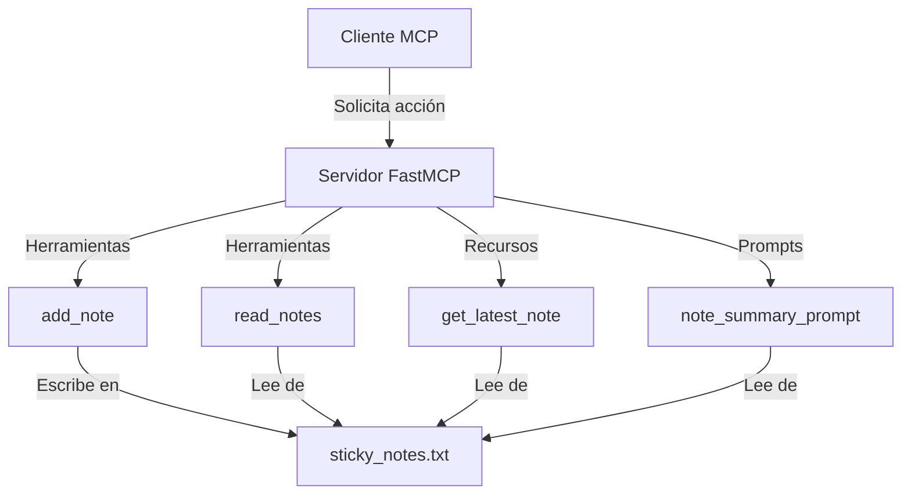
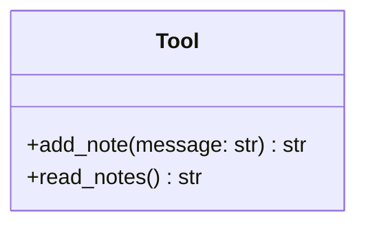
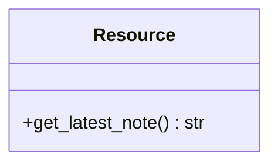
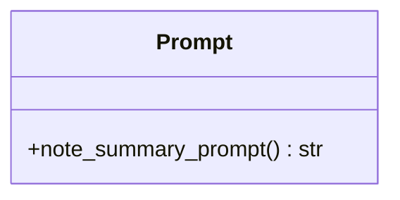
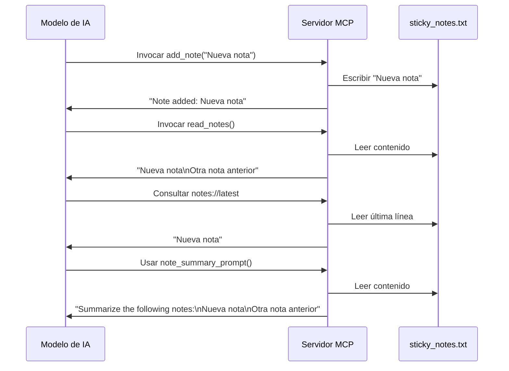
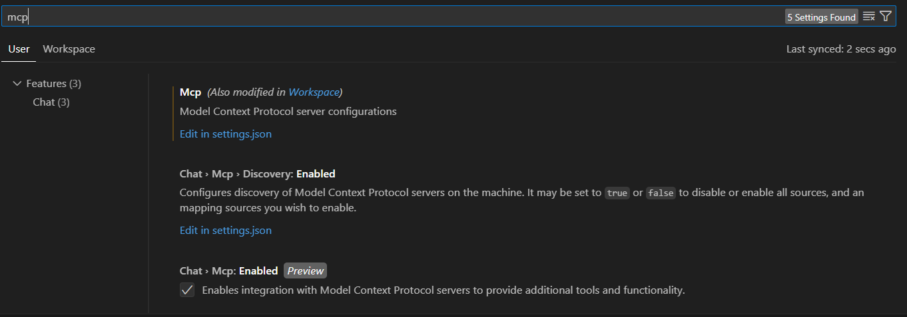

# 📝 Creación de MCP Servers y su uso con GitHub Copilot en modo Agente

Este repositorio contiene materiales, ejemplos y una implementación de un servidor MCP (Model Context Protocol) para gestionar notas adhesivas, utilizado en la charla sobre integración de servidores MCP con GitHub Copilot en modo agente.

---

## 📢 Primera parte: Acerca de la charla

### 📋 Descripción

Esta charla de una hora está orientada a desarrolladores interesados en extender las capacidades de GitHub Copilot mediante servidores MCP personalizados y comprender el flujo de trabajo de los agentes. Aprenderás a crear e integrar servidores MCP con GitHub Copilot y Claude AI.

### 📚 Temario

1. Introducción a MCP y su propósito
2. Arquitectura de un servidor MCP
3. Ejemplo práctico: Creación de un MCP Server básico
4. Integración de MCP Server con GitHub Copilot (modo agente) y con Claude AI
   - Configuración de la extensión MCP en VS Code
   - Ejecución del servidor y conexión con Copilot
   - Ejemplo de uso de Copilot para interactuar con el servidor MCP
   - Ejemplo de uso de Claude AI para interactuar con el servidor MCP
5. Casos de uso y mejores prácticas
6. Preguntas y respuestas

### ⚙️ Requisitos

- **Python**: Versión 3.10 o superior 
- **Node.js**: Versión 18 o superior
- **npm** o **yarn**: Para gestión de dependencias JavaScript
- **uv**: Gestor moderno de entornos y dependencias Python
- **Cuenta de GitHub**: Con acceso a Copilot (modo agente)
- **Editor**: VS Code recomendado con extensión MCP
- **Claude AI**: (Opcional) Para las demostraciones de integración con Claude

### 🚀 Instalación

```bash
# Clonar el repositorio
git clone https://github.com/ingfcetina/mcp-servers.git

# Navegar al directorio del proyecto
cd mcp-servers
```

### 🔗 Recursos adicionales

- [Documentación oficial de MCP](https://microsoft.github.io/model-context-protocol/)
- [GitHub Copilot Agents](https://docs.github.com/copilot/agents)
- [Python SDK para MCP](https://github.com/modelcontextprotocol/python-sdk)
- [Documentación de uv](https://github.com/astral-sh/uv)

---

## 🤖 Segunda parte: AI Sticky Notes MCP Server

### 📋 Descripción

La parte práctica de este repositorio implementa un servidor MCP (Model Context Protocol) para gestionar notas adhesivas. Permite a los modelos de IA crear, leer y resumir notas almacenadas en un archivo de texto.

### 🏗️ Arquitectura



### 🧩 Componentes

El servidor MCP ofrece tres tipos principales de componentes:

#### 🛠️ Herramientas (`@mcp.tool()`)

Las herramientas son funciones que el modelo puede invocar para realizar acciones.



- **add_note**: Agrega una nueva nota al archivo
- **read_notes**: Lee todas las notas almacenadas

#### 📚 Recursos (`@mcp.resource()`)

Los recursos proporcionan datos que el modelo puede consultar.



- **get_latest_note**: Devuelve solo la nota más reciente

#### 💬 Prompts (`@mcp.prompt()`)

Los prompts generan instrucciones personalizadas para el modelo de IA.



- **note_summary_prompt**: Crea un prompt para resumir todas las notas

### 📊 Flujo de Datos



### 🚀 Cómo Usar

#### Preparación del entorno

1. **Instala uv** (gestor de paquetes y entornos virtuales):
   ```powershell
   # En Windows PowerShell (ejecutar como administrador)
   powershell -ExecutionPolicy ByPass -c "irm https://astral.sh/uv/install.ps1 | iex"
   
   # En Linux/macOS
   curl -LsSf https://astral.sh/uv/install.sh | sh
   ```

2. **Crea un entorno virtual con Python 3.10 o superior**:
   ```bash
   # Navega al directorio del proyecto
   cd C:\mcp-servers
   
   # Crea el entorno virtual
   uv venv --python=3.10 .venv
   ```

3. **Activa el entorno virtual**:
   - En PowerShell:
     ```powershell
     .venv\Scripts\Activate.ps1
     
     # Si tienes problemas de permisos, ejecuta primero:
     Set-ExecutionPolicy -ExecutionPolicy RemoteSigned -Scope CurrentUser
     ```
   - En CMD:
     ```cmd
     .venv\Scripts\activate.bat
     ```
   - En Bash:
     ```bash
     source .venv/Scripts\activate
     ```

4. **Instala las dependencias MCP y otras requeridas**:
   ```bash
   # SDK de MCP con CLI incluido
   uv pip install "mcp[cli]"
   
   # Otras dependencias útiles
   uv pip install pydantic python-dotenv pyyaml
   ```

#### Integración con VS Code

1. **Asegúrate de tener GitHub Copilot instalado**:
   - Abre VS Code
   - Ve a la pestaña de extensiones (Ctrl+Shift+X)
   - Busca "GitHub Copilot" e instala la extensión oficial
   - Asegúrate de tener acceso a la funcionalidad de Copilot en modo agente

2. **Configura el servidor MCP en settings.json**:
   - Como se muestra en la imagen compartida  VS Code ya tiene configuración para MCP
   - Puedes verificar o modificar la configuración en tu settings.json:
   ```json
   "mcp": {
       "servers": {
           "Demo": {
               "command": "uv",
               "args": [
                   "run",
                   "--with",
                   "mcp[cli]",
                   "mcp",
                   "run",
                   "C:\\mcp-servers\\project\\main.py"
               ]
           }
       }
   }
   ```

3. **Interactúa con el servidor MCP mediante GitHub Copilot**:
   - Con Copilot en modo agente, podrás utilizar comandos como `add_note`, `read_notes`, y `get_latest_note` directamente

#### Integración con Claude AI

1. **Instala tu servidor MCP en Claude AI**:
   ```bash
   # Asegúrate de tener el entorno virtual activado
   .venv\Scripts\Activate.ps1
   
   # Instala tu servidor en Claude AI
   mcp install C:\mcp-servers\project\main.py
   ```

2. **Configura `claude_desktop_config.json`**:
   ```json
   {
     "mcpServers": {
       "Demo": {
         "command": "uv",
         "args": [
           "run",
           "--with",
           "mcp[cli]",
           "mcp",
           "run",
           "C:\\mcp-servers\\project\\main.py"
         ]
       }
     }
   }
   ```

3. **Interactúa con el servidor a través de Claude AI**:
   - Reinicia el cliente de Claude AI
   - Selecciona el servidor MCP "Demo" en la configuración
   - Usa comandos como `add_note`, `read_notes` y `get_latest_note` en tus conversaciones

#### Ejecución directa para desarrollo

Para ejecutar el servidor MCP directamente:

```bash
# Activa el entorno virtual
.venv\Scripts\Activate.ps1

# Ejecuta el servidor MCP en modo desarrollo
uv run --with mcp mcp dev project/main.py

# Alternativa para ejecución sin inspector
uv run --with mcp mcp run project/main.py
```

El Inspector MCP se abrirá automáticamente en tu navegador en http://localhost:6277.

### 🔧 Solución de problemas comunes

- **Error: Puerto en uso (6277)**
  ```bash
  # Identifica el proceso usando el puerto
  netstat -ano | findstr :6277
  
  # Termina el proceso (reemplaza <PID> con el número identificado)
  taskkill /F /PID <PID>
  ```

- **Error de conexión**: Si ves "Connection Error, is your MCP server running?":
  - Asegúrate de que el servidor esté corriendo
  - Verifica que no haya firewalls bloqueando la conexión
  - Comprueba que la ruta al archivo main.py sea correcta

- **Entorno virtual no se activa**:
  - Si usas conda y uv simultáneamente, primero desactiva conda:
    ```bash
    conda deactivate
    ```
  - Luego activa el entorno uv

## 📋 Referencia de API

| Tipo | Nombre | Descripción |
|------|--------|-------------|
| 🛠️ Tool | add_note | Agrega una nota al archivo |
| 🛠️ Tool | read_notes | Lee todas las notas del archivo |
| 📚 Resource | notes://latest | Obtiene la nota más reciente |
| 💬 Prompt | note_summary_prompt | Genera un prompt para resumir notas |

---

## 📄 Licencia

para el código y los ejemplos en este repositorio, se aplica la licencia GNU General Public License v3.0 (GPL-3.0). Puedes usar, modificar y distribuir el código bajo los términos de esta licencia. Consulta el archivo `LICENSE` para más detalles.