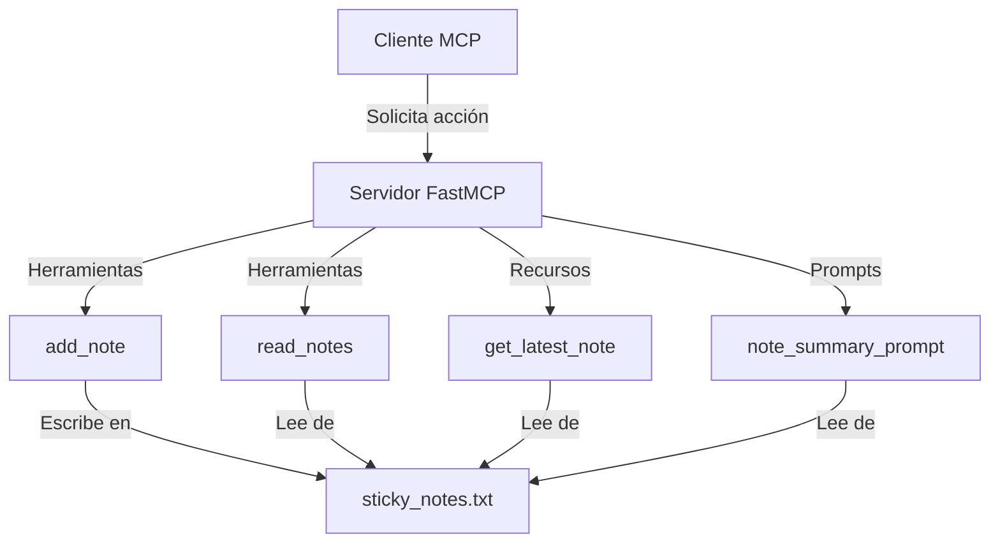
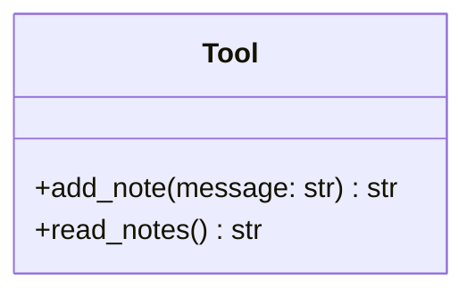
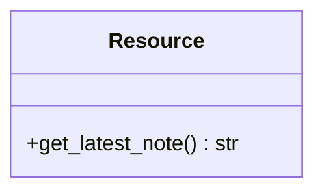
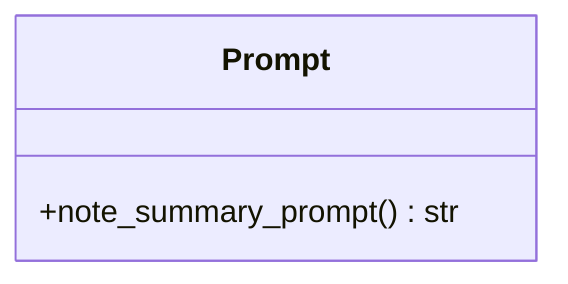
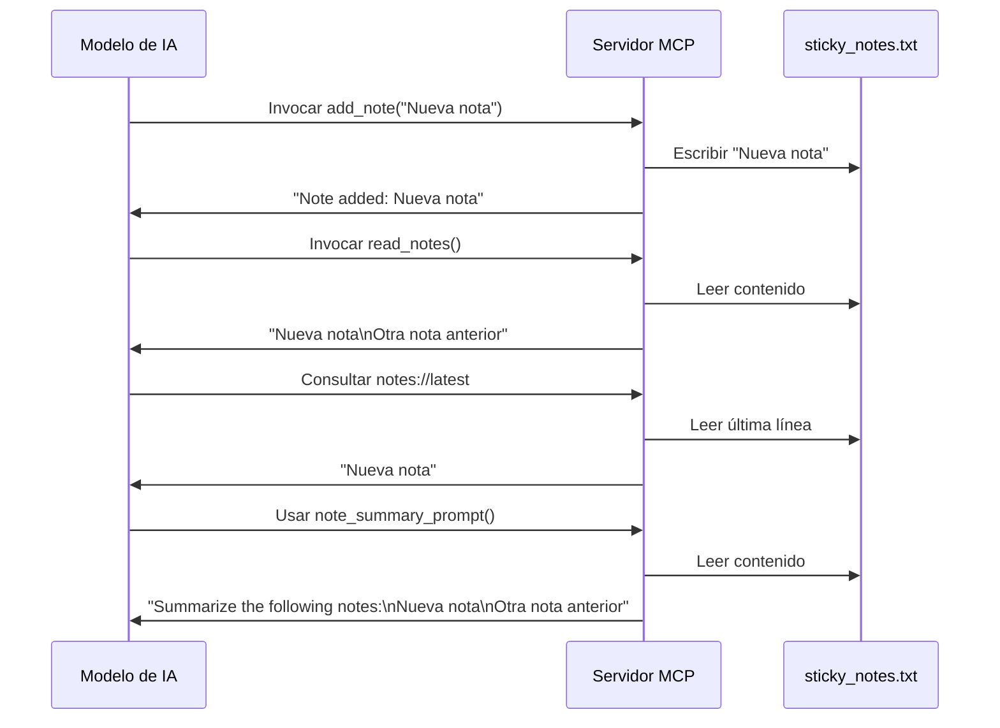

# 📝 AI Sticky Notes MCP Server

## 📋 Descripción

Este proyecto implementa un servidor MCP (Model Context Protocol) para gestionar notas adhesivas. Permite a los modelos de IA crear, leer y resumir notas almacenadas en un archivo de texto.

## 🏗️ Arquitectura



## 🧩 Componentes

El servidor MCP ofrece tres tipos principales de componentes:

### 🛠️ Herramientas (`@mcp.tool()`)

Las herramientas son funciones que el modelo puede invocar para realizar acciones.



- **add_note**: Agrega una nueva nota al archivo
- **read_notes**: Lee todas las notas almacenadas

### 📚 Recursos (`@mcp.resource()`)

Los recursos proporcionan datos que el modelo puede consultar.



- **get_latest_note**: Devuelve solo la nota más reciente

### 💬 Prompts (`@mcp.prompt()`)

Los prompts generan instrucciones personalizadas para el modelo de IA.



- **note_summary_prompt**: Crea un prompt para resumir todas las notas

## 📊 Flujo de Datos



## 🚀 Cómo Usar

Para usar este servidor MCP en VS Code:

1. Asegúrate de tener la extensión MCP instalada
2. Configura el servidor en settings.json:
```json
"mcp": {
    "servers": {
        "Demo": {
            "command": "uv",
            "args": [
                "run",
                "--with",
                "mcp[cli]",
                "mcp",
                "run",
                "C:\\mcp-servers\\project\\main.py"
            ]
        }
    }
}
```
3. Abre el Inspector MCP y selecciona "Demo"

## 📋 Referencia

| Tipo | Nombre | Descripción |
|------|--------|-------------|
| 🛠️ Tool | add_note | Agrega una nota al archivo |
| 🛠️ Tool | read_notes | Lee todas las notas del archivo |
| 📚 Resource | notes://latest | Obtiene la nota más reciente |
| 💬 Prompt | note_summary_prompt | Genera un prompt para resumir notas |